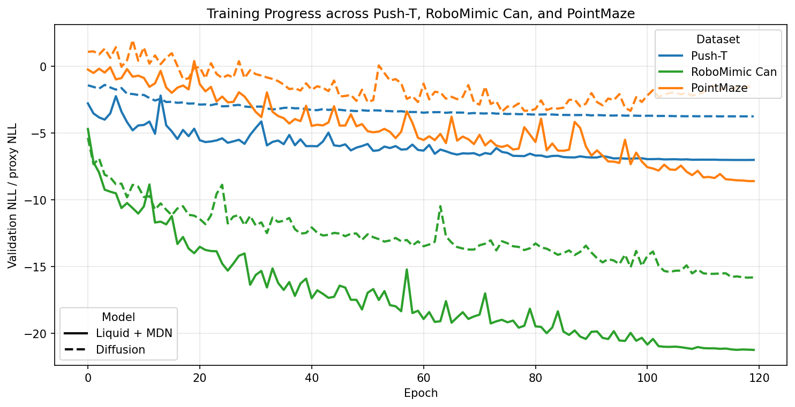
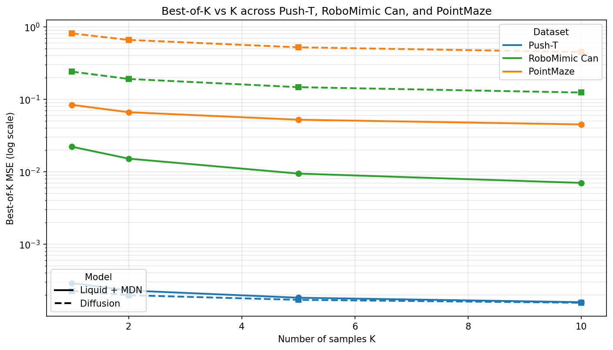
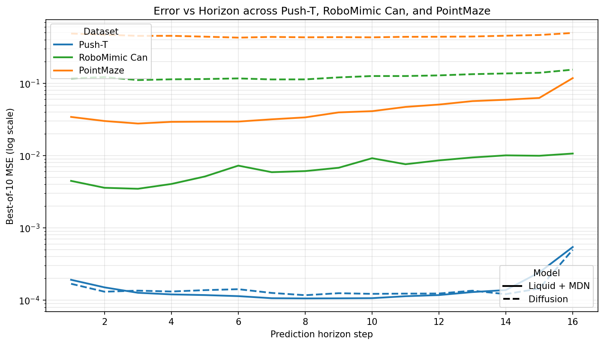
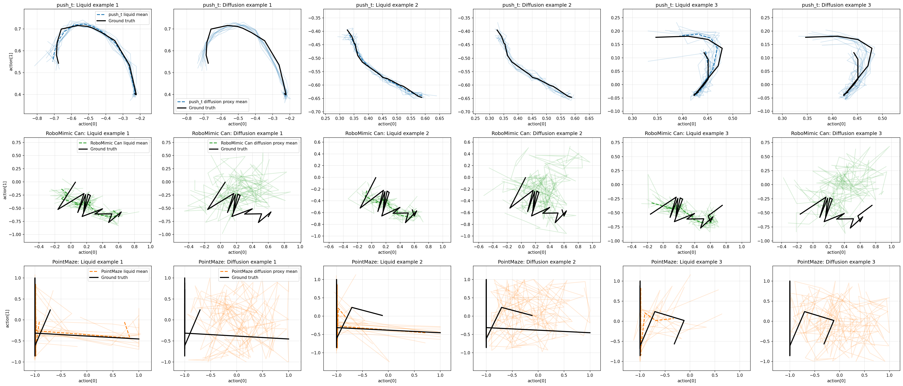
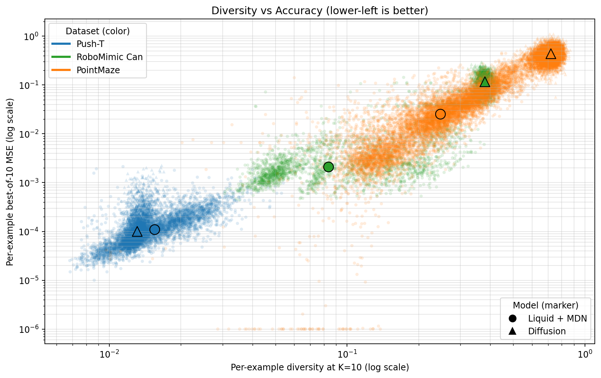

# Liquid Networks vs Diffusion Policies (JEPA Fair-Backbone Study)

This repository contains the code and notebooks for a controlled comparison of **Liquid+MDN** and **Diffusion** policy heads under a shared JEPA-style backbone.

## Notebook Pipeline (Canonical)

Run notebooks in this order:

1. **01_training.ipynb**  
   Train models and generate offline metrics/artifacts.
2. **02_pointmaze_eval.ipynb**  
   Run PointMaze closed-loop evaluation (**Python 3.12 / MuJoCo kernel**).
3. **03_analysis.ipynb**  
   Generate analysis figures used in the paper.
4. **04_pusht_closedloop.ipynb**  
   Generate Push-T closed-loop numbers used in Table 2.
5. **05_libero_comparison.ipynb**  
   Optional methodology extension for LIBERO interface studies.

---

## Environment Notes

- `.venv` (Python 3.14): training + analysis notebooks (`01`, `03`, `04`, `05`)
- `.venv312` (Python 3.12): PointMaze MuJoCo notebook (`02`)

PointMaze requires `mujoco` + `gymnasium-robotics` in the Python 3.12 environment.

---

## Key Figures

### Training Progress (Push-T vs RoboMimic Can vs PointMaze)

### Best-of-K Performance Curve

### Error vs Horizon Analysis

### Qualitative Trajectory Samples

### Diversity vs Error Trade-off

---

## Paper Artifacts

- Manuscript source: `paper/main.tex`
- Main analysis outputs are written into `artifacts/` (including sample-efficiency and closed-loop figures)

---

## Notes on Legacy Notebooks

The `transfomer/` folder contains earlier exploratory notebooks and baselines.  
The numbered notebooks above are the maintained, paper-aligned workflow.